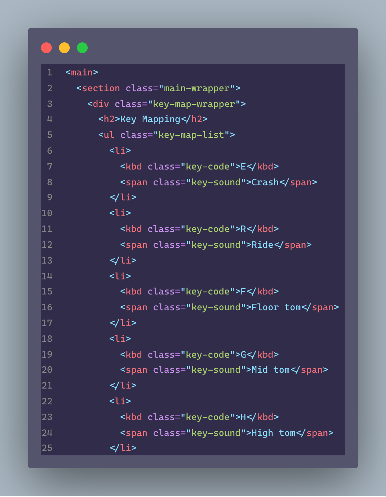
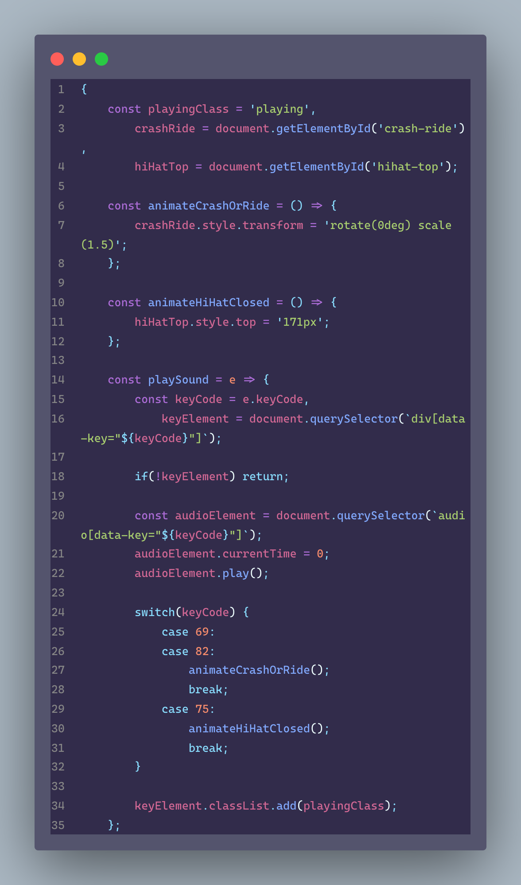
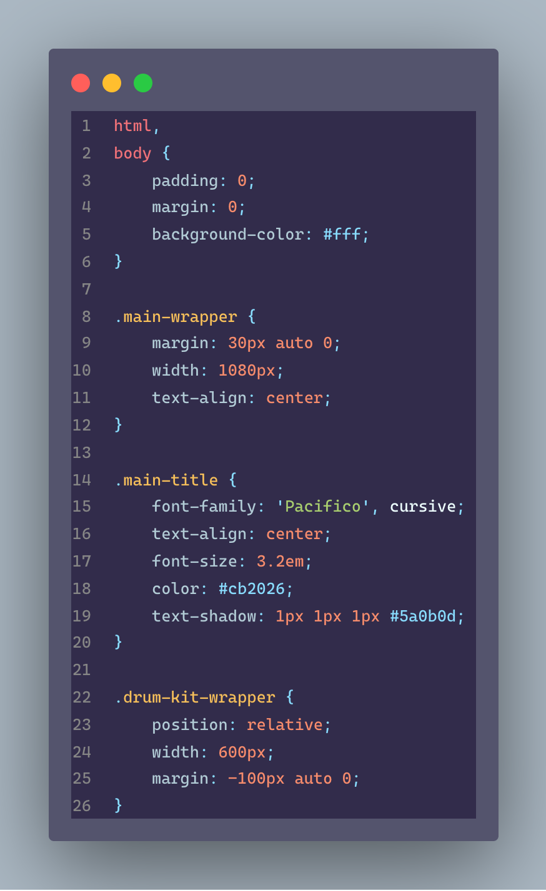

# Modern Purple Theme

This extension for Visual Studio Code adds themes titled "Modern Purple Theme".

See the [CHANGELOG](CHANGELOG.md) for the latest changes.

**Modern Purple Theme**
**HTML**


**JavaScript**


**CSS**


## Installation
1. Open **Extensions** sidebar panel in Visual Studio Code. `View → Extensions`
2. Search for `Modern Purple Theme`
3. Click **Install**
4. Click **Reload**
5. File > Preferences > Color Theme > **Modern Purple Theme**
6. Optional: Use the recommended settings below for best experience

## Recommended Settings
```js
{
        "editor.fontFamily": "Cascadia Code",
        "editor.fontSize": 13,
        "editor.fontLigatures": true,
        "editor.lineHeight": 22,
        "editor.letterSpacing": 0.7,
        "files.trimTrailingWhitespace": true,
        "editor.renderWhitespace": "trailing",
        "editor.fontWeight": "450",
        "editor.cursorStyle": "line",
        "editor.cursorWidth": 2,
        "editor.cursorBlinking": "smooth",
        "explorer.compactFolders": false,
}
```
