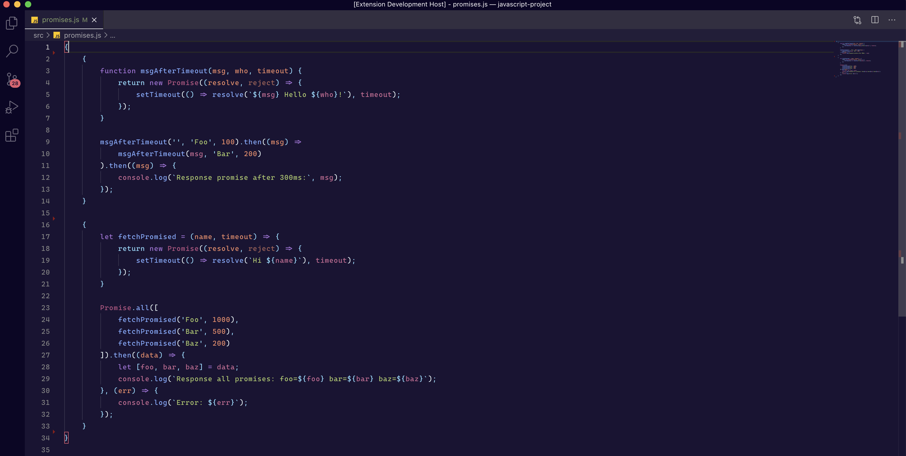
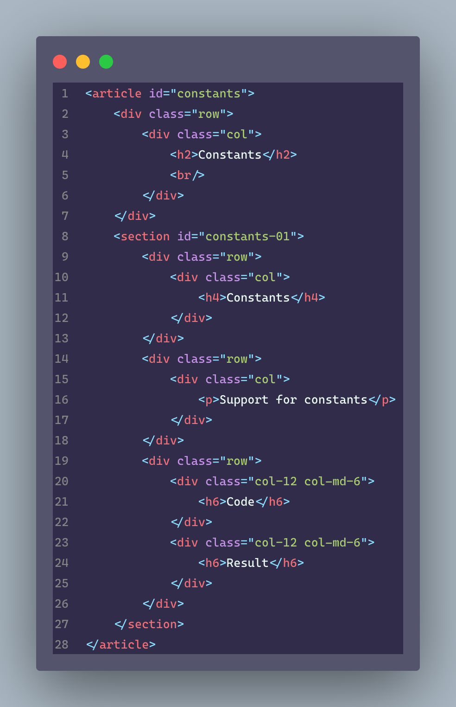

# Modern Purple Theme for [Visual Studio Code](http://code.visualstudio.com)

[](https://marketplace.visualstudio.com/items?itemName=nataliefruitema.modern-purple-theme)
[](https://marketplace.visualstudio.com/items?itemName=nataliefruitema.modern-purple-theme)
[](https://marketplace.visualstudio.com/items?itemName=nataliefruitema.modern-purple-theme)

See the [CHANGELOG](CHANGELOG.md) for the latest changes.

**Overview**



**HTML**




## Installation

1. Open **Extensions** sidebar panel in Visual Studio Code. `View → Extensions`
2. Search for `Modern Purple Theme`
3. Click **Install**
4. Click **Reload**
5. File > Preferences > Color Theme > **Modern Purple Theme**
6. Optional: Use the recommended settings below for best experience

## Recommended Settings

```json
{
  "editor.cursorBlinking": "smooth",
  "editor.cursorStyle": "line",
  "editor.cursorWidth": 2,
  "editor.fontFamily": "Cascadia Code",
  "editor.fontLigatures": true,
  "editor.fontSize": 13,
  "editor.fontWeight": "450",
  "editor.letterSpacing": 0.7,
  "editor.lineHeight": 22,
  "editor.renderWhitespace": "trailing",
  "explorer.compactFolders": false,
  "files.trimTrailingWhitespace": true
}
```
